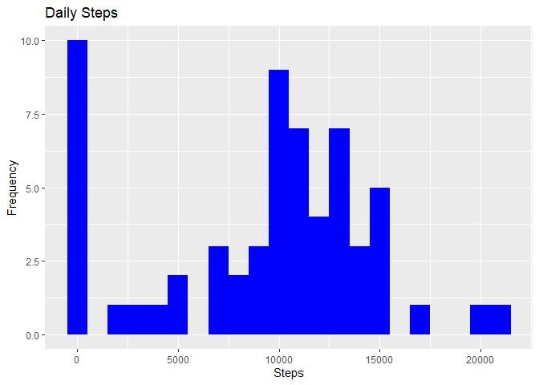

## Loading and preprocessing the data

1. Load the data (i.e. read.csv())


```r
library("data.table")
library(ggplot2)

unzip("activity.zip")

getData <- data.table::fread(input = "activity.csv")
```
## What is mean total number of steps taken per day?

1. Make a histogram of the total number of steps taken each day

```r
totalSteps <- getData[, c(lapply(.SD, sum, na.rm = FALSE)), .SDcols = c("steps"), by = .(date)] 

print({hist(x = totalSteps$steps ,main="Total number of steps taken each day", xlab="Steps")})
```

<!-- -->

```
## $breaks
## [1]     0  5000 10000 15000 20000 25000
## 
## $counts
## [1]  5 12 28  6  2
## 
## $density
## [1] 1.886792e-05 4.528302e-05 1.056604e-04 2.264151e-05 7.547170e-06
## 
## $mids
## [1]  2500  7500 12500 17500 22500
## 
## $xname
## [1] "totalSteps$steps"
## 
## $equidist
## [1] TRUE
## 
## attr(,"class")
## [1] "histogram"
```

2. Calculate and report the mean and median total number of steps taken per day 

```r
totalSteps[, .(MeanSteps = mean(steps, na.rm = TRUE), MedianSteps = median(steps, na.rm = TRUE))]
```

```
##    MeanSteps MedianSteps
## 1:  10766.19       10765
```

## What is the average daily activity pattern?

1. Make a time series plot (i.e. 𝚝𝚢𝚙𝚎 = "𝚕") of the 5-minute interval (x-axis) and the average number of steps taken, averaged across all days (y-axis)


```r
intervalData <- getData[, c(lapply(.SD, mean, na.rm = TRUE)), .SDcols = c("steps"), by = .(interval)] 
print({ggplot(intervalData, aes(x = interval , y = steps)) + 
  geom_line(color="blue", size=1) + 
  labs(title = "Average Daily Steps", x = "Interval", y ="AverageSteps per day")})
```

<!-- -->

2. Which 5-minute interval, on average across all the days in the dataset, contains the maximum number of steps?


```r
intervalData[steps == max(steps), .(max_interval = interval)]
```

```
##    max_interval
## 1:          835
```

## Imputing missing values

1. Calculate and report the total number of missing values in the dataset (i.e. the total number of rows with 𝙽𝙰s)


```r
getData[is.na(steps), .N ]
```

```
## [1] 2304
```

2. Devise a strategy for filling in all of the missing values in the dataset. The strategy does not need to be sophisticated. For example, you could use the mean/median for that day, or the mean for that 5-minute interval, etc.


```r
getData[is.na(steps), "steps"] <- getData[, c(lapply(.SD, median, na.rm = TRUE)), .SDcols = c("steps")]
```

3. Create a new dataset that is equal to the original dataset but with the missing data filled in.


```r
data.table::fwrite(x = getData, file = "tidyData.csv", quote = FALSE)
```

4. Make a histogram of the total number of steps taken each day and calculate and report the mean and median total number of steps taken per day. Do these values differ from the estimates from the first part of the assignment? What is the impact of imputing missing data on the estimates of the total daily number of steps?


```r
totalSteps <- getData[, c(lapply(.SD, sum)), .SDcols = c("steps"), by = .(date)] 

totalSteps[, .(MeanSteps = mean(steps), MedianSteps = median(steps))]
```

```
##    MeanSteps MedianSteps
## 1:   9354.23       10395
```

```r
print({
  ggplot(totalSteps, aes(x = steps)) + 
  geom_histogram(fill = "blue", binwidth = 1000) + 
  labs(title = "Daily Steps", x = "Steps", y = "Frequency")
})
```

<!-- -->


## Are there differences in activity patterns between weekdays and weekends?

1. Create a new factor variable in the dataset with two levels – “weekday” and “weekend” indicating whether a given date is a weekday or weekend day.


```r
getData <- data.table::fread(input = "data/activity.csv")
getData[, date := as.POSIXct(date, format = "%Y-%m-%d")]
getData[, `Day of Week`:= weekdays(x = date)]
getData[grepl(pattern = "Monday|Tuesday|Wednesday|Thursday|Friday", x = `Day of Week`), "weekday or weekend"] <- "weekday"
getData[grepl(pattern = "Saturday|Sunday", x = `Day of Week`), "weekday or weekend"] <- "weekend"
getData[, `weekday or weekend` := as.factor(`weekday or weekend`)]
```

2. Make a panel plot containing a time series plot (i.e. 𝚝𝚢𝚙𝚎 = "𝚕") of the 5-minute interval (x-axis) and the average number of steps taken, averaged across all weekday days or weekend days (y-axis). See the README file in the GitHub repository to see an example of what this plot should look like using simulated data.


```r
getData[is.na(steps), "steps"] <- getData[, c(lapply(.SD, median, na.rm = TRUE)), .SDcols = c("steps")]
intervalData <- getData[, c(lapply(.SD, mean, na.rm = TRUE)), .SDcols = c("steps"), by = .(interval, `weekday or weekend`)] 
print({
  ggplot(intervalData , aes(x = interval , y = steps, color=`weekday or weekend`)) + geom_line() +
  labs(title = "Average Daily Steps by Weektype", x = "Interval", y = "No. of Steps") + 
  facet_wrap(~`weekday or weekend` , ncol = 1, nrow=2)
})
```

<!-- -->


